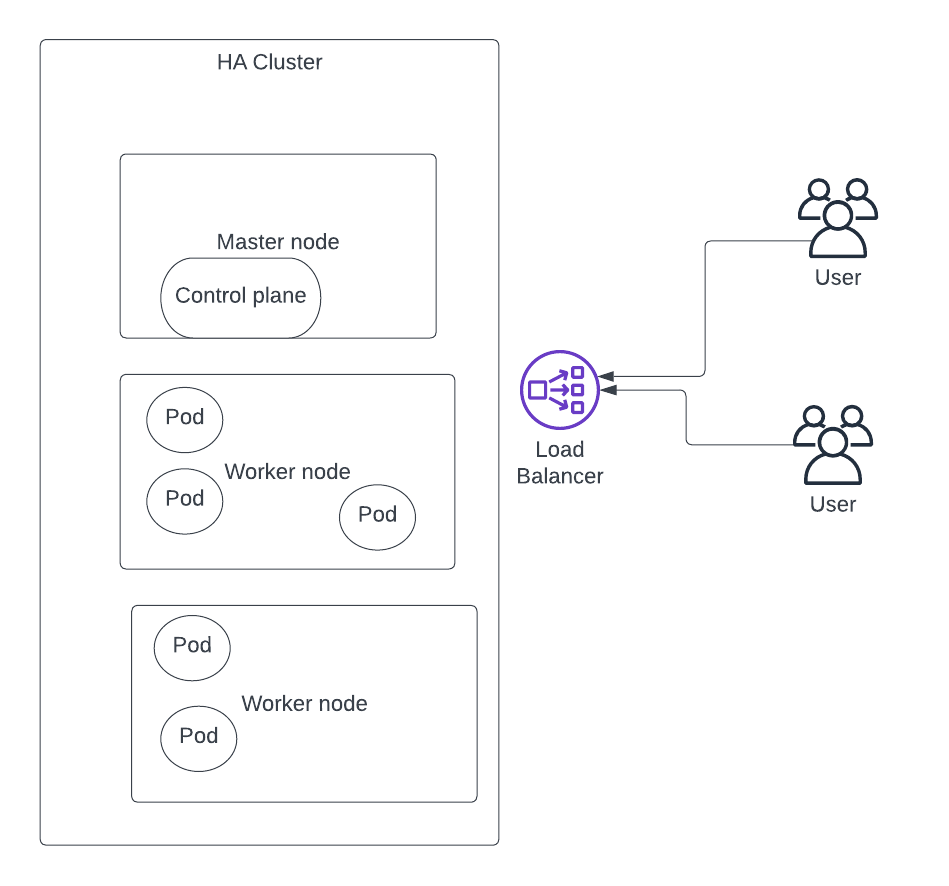
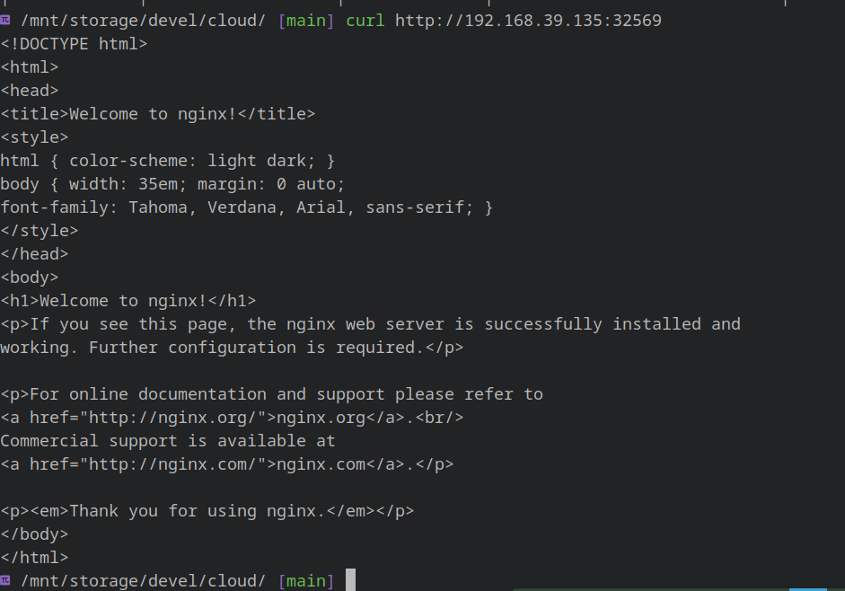
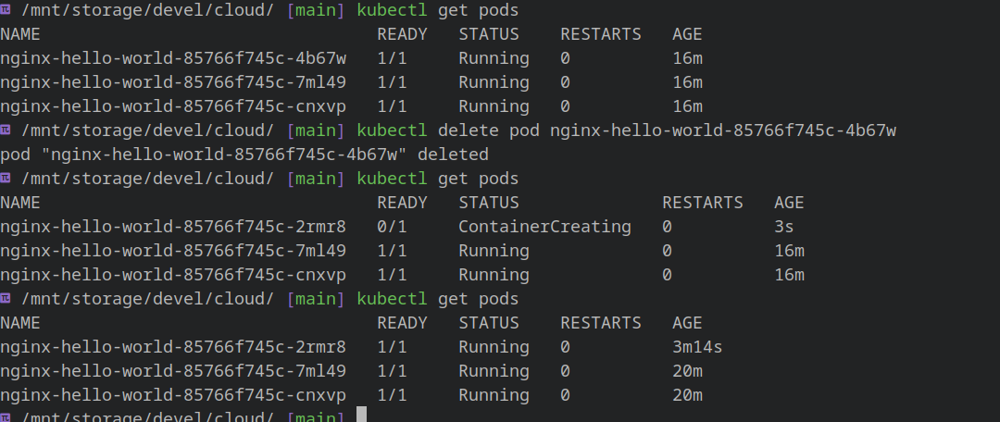
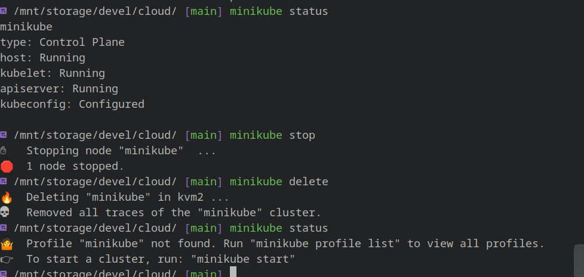

# HA Cluster Example with Setup

## Deployment

- Install `minikube` to simulate a cluster deployed on cloud with multiple nodes.

- Install `kubectl` to manage kubernetes cluster.

- Start the `minikube` cluster with appropriate hypervisor (KVM in this case).

- Check if cluster is up and running. In this case there is only 1 node, which contains both control plane and deployment pods, which is different from the HLD diagram above.

- Using the YAML file in the repository, we start the deployment of a cluster running Nginx web server. For high availability, it has a replica set of 3.

- Check the status of deployment and the pods that are running.

- The web server is now successfully running inside the `minikube` cluster, which is running inside a VM managed by `minikube`.

- To access the cluster from outside this VM, `minikube` has setup port forwarding to access the services in the cluster.

- We can access the web server from outside the cluster.

- We can test the auto healing feature by deleting 1 pod in the cluster.

- The web server will remain available even when 1 pod was deleted.

- Kubernetes will create another pod when it detects that its state is different from that specified in the YAML config file.

- We can bring down the cluster when we are done.

- Finally delete the `minikube` VM.

